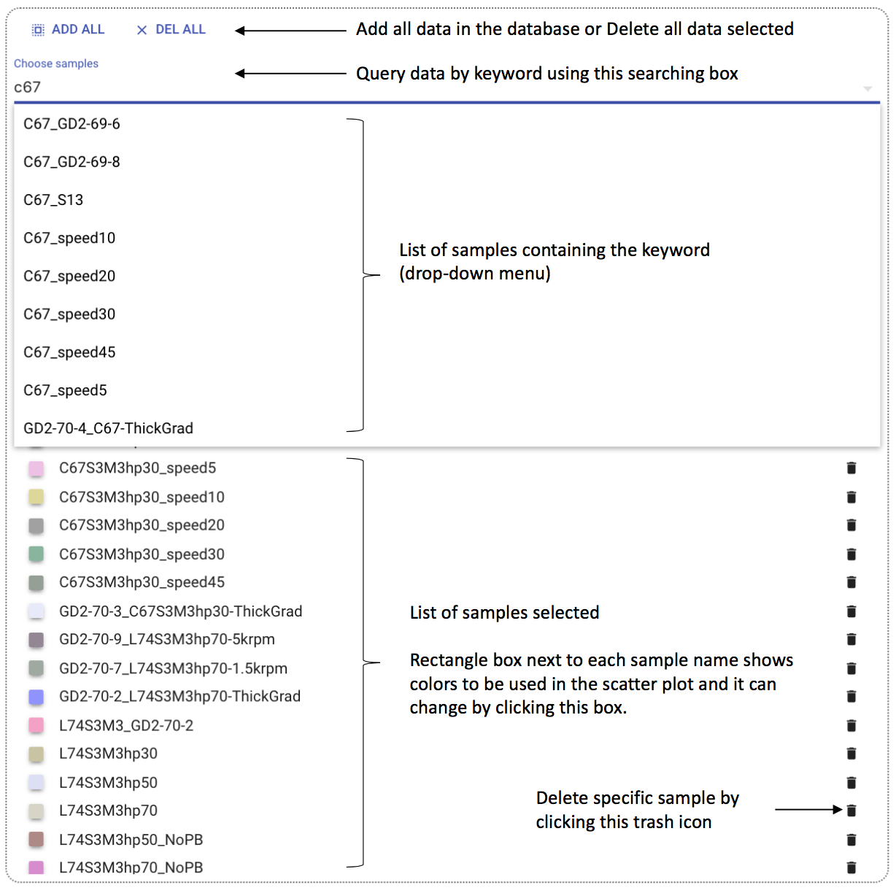

# MultiSciView

MultiSciView is an interactive visualization tool to explore and visualize large-scale data in which each data datum consists of multivariate attributes and an image. This tool is initially developed for X-ray images (high-resolution and -dynamic-range) obtained from synchrotron beamlines that are typically associated with a variety of metadata, but its utilization is not limited to specific data kinds.

## Contents
- [Structures](#structures)
- [Installation](#installation)
    - [For Front-end Developers](#installa)
    - [For Back-end Developers](#installb)
- [Run MultiSciView](#run)
    - [STEP 1: Build database with MongoDB](#step1)
    - [STEP 2: Run a web server](#step2)
- [Play MultiSciView](#play)

## [Structures](#structures)
- config: containing config files for webpack
- docs: containing MultiSciView application javascript files
- multiview: containing back-end web server (including bundled javascript codes) for MultiSciView application 
- src/lib: containing low-level javascript library for interative visualization

## [Installation](#installation)
Download (or clone) this repository containing, then ...

### [For Front-end Developers](#installa)
1. Install nodejs v6.x (with higher version, it may fail to compile codes), and then
2. type ```npm install``` to install all required packages
3. type ```npm run apptest``` for developing (webpack watch mode)

Note that in watch mode it will automatically detect any changes under **/docs** and **/src** folders and output bundled files in **/multiview/static/js** folder. Webpack configuration can be found in **/config** folder.

### [For Back-end Developers](#installb)
Flask and Flask-restful are used for the back-end. Required python packages are listed in **/multiview/requirements.txt**.

## [Run MultiSciView](#run)
Assuming users pre-compiled (or in webpack watch mode) and saved bundled javascript files in **/multiview/static/js** and corresponding html files in **/multiview/templates**. Without any changes in webpack configuration settings (or from this repository), you may have **react-multiview-home.js** and **react-multiview-documentation.js** bundled javascript files, and **index.html** and **documentation.html** html files. Note that files containing **documentation** word is reserved for the future usage. For now, it does not have any effects on running the tool, MultiSciView. 

### [STEP 1: Build database with MongoDB](#step1) 
The first step is to construct and run your database on a server or a local machine. To construct a database with your own database, we provide a python script named **/multiview/multiviewdb.py**. You can build your own database by running the script in python. 

The script assumes that for each data point to visualize you have one **.xml** file containing metadata information and one **.tiff** file for a X-ray image. It further assumes the structure of the xml file as followings:
```xml
<DataFile name="path/path/tiff-file-name.tiff" ... other fields ...>
    <protocol name="protocol-name" ... other fields ...>
        <result name="metadata-name" value="metadata-value" />
        ... other result tags ...
    </protocol>
    ... other protocol tags ...
</DataFile>
```  
Note that in the above xml template it only shows required fields in each tag. Additional fields can be freely added and configured what fields will be included (or excluded) in a configuration file. An example for the configuration file can be found in **/multiview/db/saxs_v2/db_config.py** in which you can also specify your data location and MongoDB parameters as following:
```python
MONGODB_CONFIG = {
    'ROOT': 'absolute path to root directory of your data',
    'DB': {
        'HOST': 'localhost',         # host name
        'PORT': 27017,               # port number
        'NAME': 'multiview_saxs_v2', # DB name
        'COLLECTION': 'saxs_v2'      # Collection name
    },
    'XML': {
        'DIR': 'path to a directory for xml files w.r.t ROOT',
        'SAMPLE_SPLIT': '_th0.',        # a keyword to split same name (or tiff file name)
        'TIMESTAMP': 'save_timestamp',  # field name for time stamp
        'ROOTID': 'name',               # field name for DataFile tag ID
        'PID': 'name',                  # field name for protocol tag ID
        'RID': 'name',                  # field name for result tag ID
        'RVAL': 'value',                # filed name for result tag value
        'P_EXCLUDE': [...]              # list of field names to ignore in protocol tag
        'R_EXCLUDE': [...]              # list of field names to ignore in result tag
    },
    'TIFF': {
        'SAVE': True,          # save X-ray image ?
        'EXT': ['', '.tiff'],  # list of extension of X-ray image
        'DIR': 'path to a directory for X-ray image files w.r.t ROOT'
    },
    ... 
}
```
Note that for more configuable parameters and detailed descriptions, see the example config file under **/multiview/db/**. One can readily modify **/multiview/multiviewdb.py** files to support different structures of a xml file and image-like data. Please contact to authors for more details.

### [STEP 2: Run a web server](#step2)
We also provide a python script to run a web server powered by [Flask](http://flask.pocoo.org/) and [Flask-RESTful](https://flask-restful.readthedocs.io/en/latest/). One can find the script in **/multiview/app.py**. To run the script properly, one needs to modify two things. First, user need to import appropriate database configuration file, which is created in [STEP 1](#step1)( for example, **/multiview/db/saxs_v2/db_config.py**) as following:
```python
from db.saxs_v2.db_config import MONGODB_CONFIG
``` 
The other thing is to modify host name and port number for the web server as following:
```python
SERVER_HOST = 'localhost'
SERVER_PORT = 8001
```
Executing the python script file will launch the web server and user can access to MultiSciView tool at [http://localhost:8001/](). To be visible across the internal network, user can set the host as follows:
```python
SERVER_HOST = '0.0.0.0'
```

## [Play MultiSciView](#play)
The MultiSciView largely consists of two parts. One part is to visualize data in scatter plot and the other part is a control panel. In the control panel, users can select data to be visualized in the scatter plot with selected two attributes. There are variety of color schemes users can select based on sample name or selected attributes and the range of color scheme can be interactively changed. Data points can be replaced with X-ray images with user interaction and the scatter plot can be zoomed-in until the pixel level of the images. Users also can select a color scheme and control its dynamic ranges, interactively. Finally, MultiSciView provides parallel coordinate plot that is connected with the scatter plot so that users can easily navigate (selected) attribute space and investigate their correlations. Furthermore, the parallel coordinate plot can be utilzed to filter some data points out from the scatter plot so that users can easily concentrate on the regions of interests in each attributes. In the following, we will describe how these functionalities is interactively used by users.  

![fig:overview][img_overview]
*Overview of MultiSciView*

### [Data panel](#data)
In the data panel, users can select (or query) from the connected database and delete samples from the visualization. All data can be selected or deleted by clicking a button on the top of the panel. Or, users can query specific samples containing user provided keyword using the searching box. Then, matched sample names will appear in the drop-down menu. Selected samples are listed below the searching box with randomly selected colors for each sample (colored rectangle box next to sample names) and the color can be used for any data visualizations in the tool. By clicking the box, users can change colors for each sample and clicking trash icons allows users deleting specific samples and corresponding data points from any data visualizations in the tool. 


*Data panel*

### [Axis panel](#axis)
In the axis panel, users can select three attributes and a color schemes for the scatter. The first two attributes are for the x- and y-axis of the scatter plot and the third attribute is for the color encoding of the plot. For the color encoding, we provide a variaty of color schemes and users can easily control the range of a color scheme by dragging handlers (red colored triangles above the color bar). All attributes and a color scheme can be easily selected using the dropdown menu. Note that the color encoding scheme selected in this panel is also applied to the parallel coordinate plot for the consistency.

![fig:axispanel][img_axispanel]
*Axis panel*

### [Image panel](#image)
In the image panel, using a button labeled 'SHOW IMAGE', users can trigger to show X-ray images instead of data points in the scatter plot. There are one additional control parameter to show the images corresponding each data point in the scatter plot. It is the minimum number of data points appeared in the scatter plot that can be controlled by the slider right below the button. The other slider in the panel can be used to set initial image side. As the size of images is dynamically changing according to user interactions (zoom in/out via mouse wheel), it will not give an effect if the current image size is larger than the value set by the slider. Lastly, users can select a color scheme from the dropdown menu and change the dynamic range of images using the handlers in the color bar like the way in the [axis panel](#axis).

![fig:imagepanel][img_imagepanel]
*Image panel*

### [Parallel Coordinate Plot (PCP) panel](#pcp)
In the parallel coordinate plot (PCP) panel, users can explore the selected data using PCP. There are two interactions users can apply to the PCP. First, users can change the order of axies by dragging each axis by mouse. This will help to reveal the correlations among the selected attributes. The other interaction is to filter data points out by selecting range of interests in each attribute axis. As the PCP is tightly connected to the scatter plot, the change of the range will dynamically change the scatter plot. In addition, an attributes used for the color encoding is selected and the change will be also applied to the scatter plot (and [vise versa](#axis)). Lastly, users can add or delete available data attributes in this panel.

![fig:pcppanel][img_pcppanel] 
*PCP panel*

[img_overview]: https://github.com/ComputationalScienceInitiative/react-multiview/blob/master/img/overview.png
[img_datapanel]: https://github.com/ComputationalScienceInitiative/react-multiview/blob/master/img/data-panel.png
[img_axispanel]: https://github.com/ComputationalScienceInitiative/react-multiview/blob/master/img/axis-panel.png
[img_imagepanel]: https://github.com/ComputationalScienceInitiative/react-multiview/blob/master/img/image-panel.png
[img_pcppanel]: https://github.com/ComputationalScienceInitiative/react-multiview/blob/master/img/pcp-panel.png


